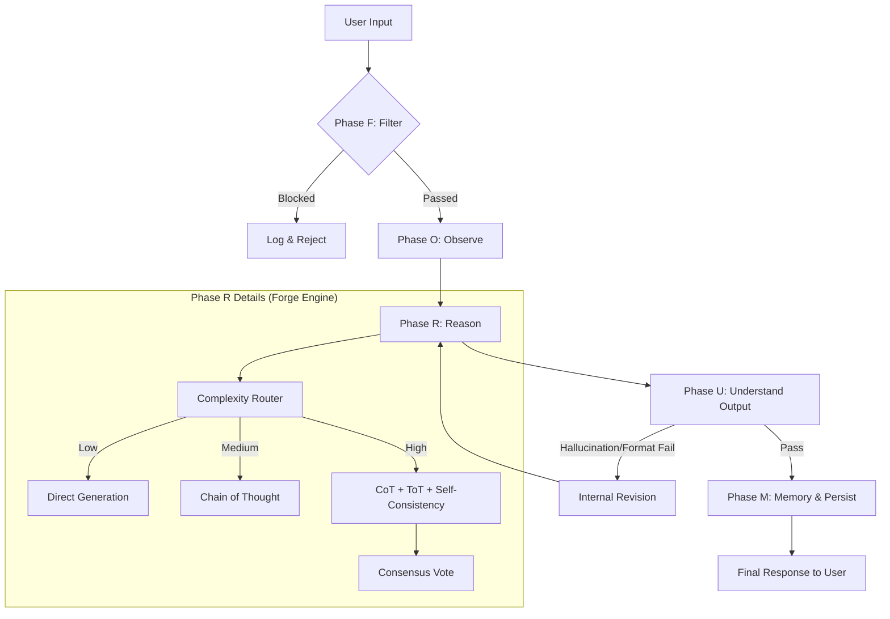
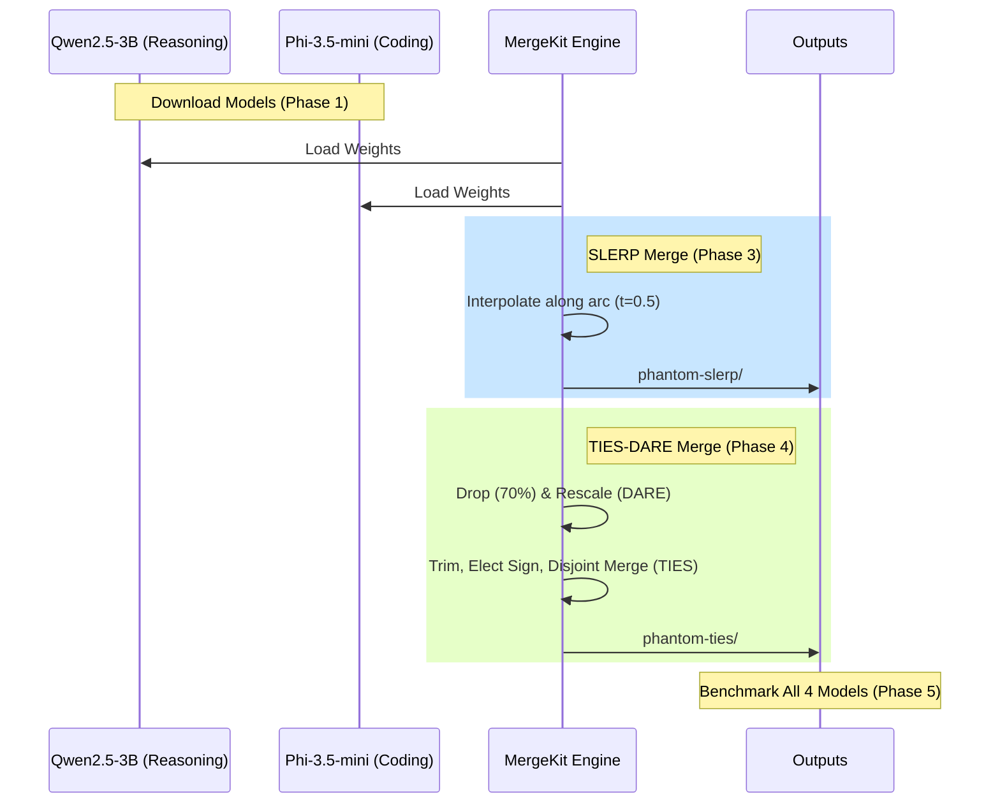

# Implementation Plan — PHANTOM-3B

PHANTOM-3B is a merged language model (Qwen2.5-3B + Phi-3.5-mini) wrapped in a sophisticated multi-reasoning system (FORUM protocol). This plan outlines the transition from a flat file structure to a professional, scalable architecture, along with the detailed logic flow for the model merging and reasoning engines.

## Proposed Structure

We will reorganize the current flat repository into the following structure to match the professional standards of the *Operation: Get Noticed* sprint.

```
phantom-3b/
├── PHANTOM.md                          ← Main brain file (identity & personality)
├── README.md                           ← Project overview & research
├── SECURITY.md                         ← PromptShield & threat model
├── BUDGET.md                           ← Hardware & token constraints
├── PRODUCT.md                          ← Roadmap & sprint tracking
├── SKILLS.md                           ← Capability registry
├── LICENSE                             ← Apache 2.0
├── .gitignore                          ← Standard Python + models exclusion
├── requirements.txt                    ← Core dependencies (MergeKit, etc.)
├── .env.example                        ← Environment template
│
├── docs/                               ← Engineering documentation
│   ├── architecture.md                 ← System blueprints
│   ├── decisions.md                    ← ADR (Architecture Decision Records)
│   └── runbooks/
│       └── merge-guide.md              ← Operational instructions
│
├── skills/                             ← Modular capability definitions
│   ├── model-merging/SKILL.md
│   ├── benchmarking/SKILL.md
│   ├── frontend/SKILL.md
│   └── reasoning/SKILL.md
│
├── tools/
│   ├── scripts/                        ← Setup, merge, and eval scripts
│   └── prompts/                        ← Benchmark & security probes
│
├── src/                                ← Source Code
│   ├── mergekit/                       ← YAML configs & generators
│   ├── benchmarks/                     ← Evaluation engine
│   └── app/                            ← Streamlit UI + Forge logic
│       ├── main.py                     ← App entry point
│       ├── forge_reasoning.py          ← Reasoning paths (CoT/ToT/SC)
│       ├── database.py                 ← SQLite persistence
│       ├── security_guard.py           ← PromptShield implementation
│       ├── web_search.py               ← googlesearch-python integration
│       └── utils.py                    ← Shared utilities
│
└── outputs/                            ← Build artifacts (models & results)
```

## System Architecture & Logic Flow

### 1. The FORUM Protocol (Execution Flow)
PHANTOM processes every query through five distinct phases to ensure precision and security.



### 2. Model Merging Pipeline (Build Flow)
The merging process mathematically combines specialized weights to create the 3B hybrid.



## Proposed Changes

### [MOVE] Existing Markdown Files
We will move the current MD files into their designated subdirectories as per the architecture spec.
- `architecture.md` → `docs/architecture.md`
- `decisions.md` → `docs/decisions.md`
- `merge-guide.md` → `docs/runbooks/merge-guide.md`
- `SKILL.md` / `SKILLS.md` → `skills/reasoning/SKILL.md` etc. (Requires sorting)

### [NEW] Configuration Files
We will create the core YAML configurations for MergeKit.

#### [NEW] [phantom-slerp.yaml](file:///c:/Users/SANJITH%20G/OneDrive/Desktop/LInked%20in/Panthom/src/mergekit/phantom-slerp.yaml)
#### [NEW] [phantom-ties-dare.yaml](file:///c:/Users/SANJITH%20G/OneDrive/Desktop/LInked%20in/Panthom/src/mergekit/phantom-ties-dare.yaml)

### [NEW] Automation Scripts
We will create the shell scripts to automate the build pipeline.
- `tools/scripts/setup.sh`: Environment and model downloads.
- `tools/scripts/merge.sh`: Execution of both merge methods.
- `tools/scripts/evaluate.sh`: Automated benchmarking.

## Implementation Steps

1.  **Initialize Directory Structure**: Create `docs/`, `src/`, `tools/`, `skills/`, `outputs/`, `database/`.
2.  **File Migration**: Relocate and rename existing files to fit the new schema.
3.  **Dependency Setup**: Generate `requirements.txt` based on `architecture.md` specs.
4.  **Configuration Generation**: Write the SLERP and TIES-DARE YAML files.
5.  **Script Implementation**: Create the automation tools for setup, merging, and benchmarking.
6.  **UI Foundation**: Create the skeleton for the Streamlit `main.py` and the Forge reasoning engine.

## Verification Plan

### Automated
- **MergeKit Validation**: Run `mergekit-yaml --help` to verify the environment.
- **Model Loading**: Use a script to load both merged models using `transformers`.
- **Benchmark Run**: Execute `run_benchmark.py` and ensure it produces `results.json`.

### Manual
- **UI Inspection**: Launch Streamlit and verify the model selector and token budget meter.
- **Merge Comparison**: Verify that the benchmark results show differentiated scores between SLERP and TIES.
